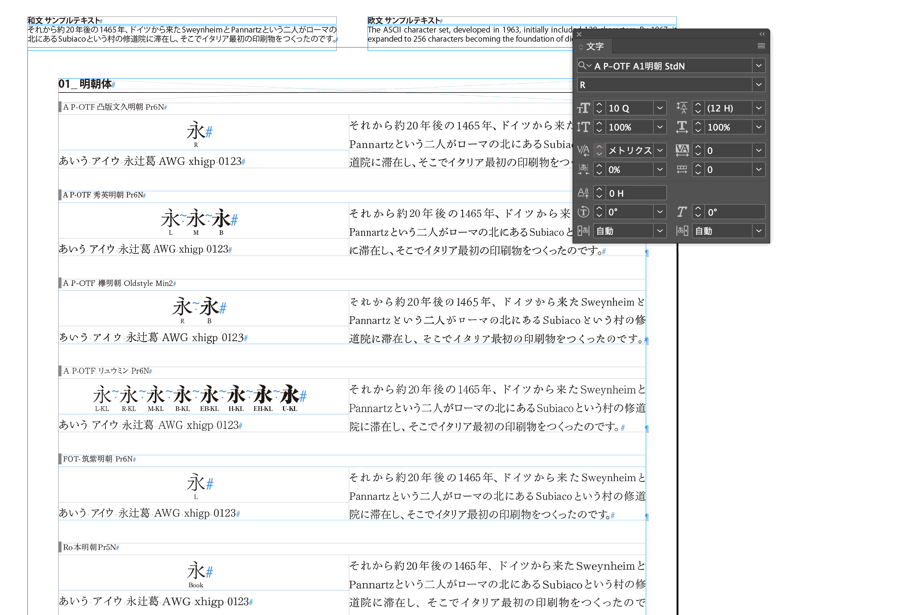

<!--![InDesign](https://img.shields.io/badge/-Adobe%20InDesign-ff3366.svg?logo=adobe-InDesign&style=flat-square）-->

<div align="center">
  
  <h3 align="center">InDesign Font List Generator</h3>
Make a list of your favorite fonts!
</div>

## 概要

Adobe InDesignを利用してフォントリストを生成するスクリプトです。事前に用意したフォントリストファイルを読み込むことで、フォーマットに合わせてフォントリストドキュメントを自動生成します。  

**デザインを進める上で、フォント選びの時間を短縮し、効率的かつ質の高い作業を支援すること**を目的としています。生成されたリストの例文に相互参照を利用しているため、テンプレートファイル上部の例文を変更・更新することで、ドキュメント全体の例文を一括で修正できます。

**動作保証バージョンはInDesign 2024（v19.x）および2025（v20.x）です**。それ以外のバージョンでもおそらく動作しますが、未検証です。

完成したドキュメントをPDFとして書き出したり、プリントアウトしたりして、フォント選びの参考にご活用ください！

## はじめに

デザインを進める過程で、フォント選び（特に和文フォント）に時間を取られることに煩わしさを感じたことが、自分好みのフォントリストを生成するスクリプトを作ろうと思ったきっかけです。  
事前に自分専用のフォントリストを持っておくことで、デザインの効率を上げ、質の良い仕事につなげられるはずです。  
そのため、**生成するフォントリストを何度もかんたんに作り直せる仕様**を目指しました。

## インストール方法

1.  GitHubリポジトリから本スクリプトを含むZIPファイルをダウンロードします。
2.  ダウンロードしたファイルを解凍します。
3.  解凍してできた一式のファイル群を、Adobe InDesignのスクリプトフォルダ内に保存します。
    * スクリプトフォルダの場所はOSやInDesignのバージョンによって異なります。下記は一例です
      * Macの場合：`[ユーザー]/Library/Preferences/Adobe InDesign
  /[InDesignのバージョン]/ja_JP/Scripts/Scripts Panel`
      * Windowsの場合：`C:\Users\[ユーザー]\AppData\Roaming\Adobe\InDesign\Version [InDesignのバージョン]-J\Scripts\Scripts Panel`

## 使い方

1.  **同梱のテンプレートファイル（`フォント一覧_temp.indt`）を開きます**。スクリプトの実行には、専用のテンプレートドキュメントが必要です。  
    ドキュメントを開くと、上部に和文と欧文の例文が置いてあります。わざとページに触れるように配置してあるので、**位置は動かさないでください**。
    
2.  InDesignのスクリプトパネルから、保存した本スクリプトを選択し、実行します。
3.  スクリプト実行後に表示されるファイル選択ダイアログで、事前に作成したフォントリストファイル（`.txt`形式）を選択します。**複数のファイルをまとめて選択することも可能です**。
    
4.  ファイルを選択して「開く」ボタンをクリックすると、スクリプトがフォントリストの生成を開始します。
5.  指定したフォントの数によっては時間がかかる場合があります。スクリプトが完了すると、InDesignドキュメントにフォントリストが生成されています。
6.  生成されたドキュメントを確認し、必要に応じてPDFへの書き出しやプリントアウトを行います。
7.  **例文の一括編集:** 生成されたリストの例文は、テンプレートファイルの一番最初のページ（または各セクションの最初のページ）にある例文を参照しています（InDesignの相互参照機能）。例文を編集し、相互参照を更新することで、生成されたすべての例文を一度に変更できます。
    

### 事前準備

スクリプトを正常に実行するためには、以下の準備が必要です。

**専用テンプレートファイル**
*   本スクリプトを実行するには、特定の構造を持つInDesignドキュメントがテンプレートとして必要です。基本的にはこのリポジトリに含まれるテンプレートファイル（`フォント一覧_temp.indt`）をご利用ください。ご自身でテンプレートを作られる場合は、下記を参照してください。
*   テンプレートファイルには、スクリプトが参照する以下の名前の要素が必要です。名前を変更するとスクリプトが正常に動作しません。
    *   **テキストフレーム**（いずれもレイヤーパネルから確認できます）：
        *   `和文サンプル`（相互参照の参照先に使用します - 日本語例文用）
        *   `欧文サンプル`（相互参照の参照先に使用します - 欧文例文用）
    *   **表スタイル**：
        *   `フォントリスト`（生成されるフォントリストの表に適用されます）
    *   **セルスタイル**：
        *   `"01_ヘッダ"`, `"02_ウェイト一覧"`, `"03_例文 固定テキスト"`, `"04_例文"`の4つ（生成されるフォントリストの表に適用されます）。
    *   **相互参照フォーマット**：
        *   `_段落テキスト全体`（生成される相互参照に使用します）
    *   **段落スタイル**：
        *   スクリプトが生成するテキストフレームに適用する段落スタイルとして、`doc.paragraphStyles`（ドキュメントの2番目の段落スタイル）が使用されます。必要に応じて、テンプレートファイルで2番目の段落スタイルを適切に設定してください。

**フォントリストファイル**

*   生成したいフォントのリストを記述したテキストファイル（`.txt`形式）を作成します。
*   拡張子を除いたファイル名がページのタイトル（セクション名）になります。
    
*   ファイルの文字コードは**UTF-8**、改行コードは**LF**（WindowsではCRLFも可）を推奨。
*   フォントリストの各行は **`[言語コード]\t[フォントファミリー名またはフォント名]`** の形式で記述します。
    *   `[言語コード]`：`J`（日本語用）または `E`（欧文用）。行頭に記述します。
    *   `\t`：タブ文字です。言語コードとフォント名の区切りに使用します。
    *   `[フォントファミリー名またはフォント名]`：リストに含めたいフォントの名前を記述します。
        *   InDesignの文字パネルから直接コピーすると間違いがなく作成しやすいです。
            
        *   **例**：
            ```text
            J	A P-OTF 欅明朝 Oldstyle Min2
            J	A P-OTF リュウミン Pr6N
            ```
        * フォントによっては、文字パネルからフォント名をコピーする際、末尾に余計なスペースが入っていることがあるので注意してください（余計なスペースは削除してOKです）
*   このルールが守られていない場合、エラーメッセージが表示されスクリプトは終了します。

**使用するフォントのインストール**

*   フォントリストファイルに記述したフォントが、スクリプトを実行する環境のシステムにインストールされており、Adobe InDesignで利用可能な状態である必要があります。
*   **インストールされていないフォントや、InDesignで利用できない状態（例: 破損している、フェイクフォントである）のフォント**がリストに含まれている場合、スクリプト実行中にエラーメッセージが表示され、処理が中断されます。事前にフォントが正しく利用できるか確認してください。

## コントリビューション

コントリビューションを歓迎します。バグ報告や改善提案はIssuesへ、コードの変更提案はPull Requestsへお願いします。

<!--
**ベータテスター**  
下記の皆さんにβテストにご協力いただきました！

-->

## ライセンス

本スクリプトは[MIT License](LICENCE.txt)の下で公開しています。

## コンタクト

バグ報告や改善提案はIssuesへお願いします。  
X: [@Uske_S](https://x.com/Uske_S)  
Bluesky: [@uskes.bsky.social](https://bsky.app/profile/uskes.bsky.social)

## 参考文献

- [shields.ioを使って技術系アイコンを量産した](https://qiita.com/s-yoshiki/items/436bbe1f7160b610b05c)  
shields.ioのアイコン表示の参考にした
- [MIT Licence（英）](https://opensource.org/license/mit)  
英語版は原文まま利用した
- [MIT Licence（日）](https://licenses.opensource.jp/MIT/MIT.html)
日本語版参考訳はオープンソースグループ・ジャパンのものを利用した
- [InDesign ExtendScript API](https://www.indesignjs.de/extendscriptAPI/indesign-latest/)
いつもお世話になっているInDesign用ExtendScriptのAPIオブジェクトモデル